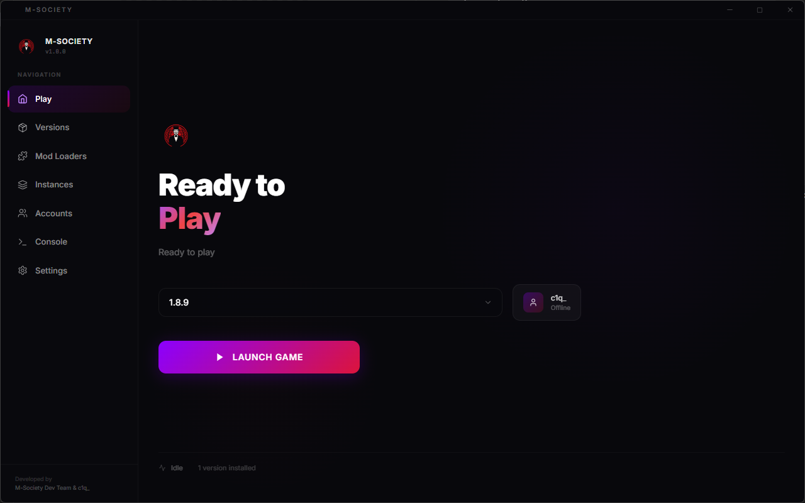
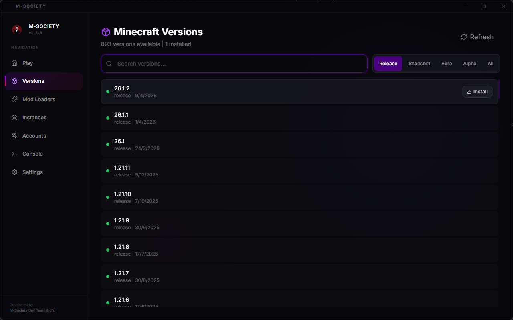
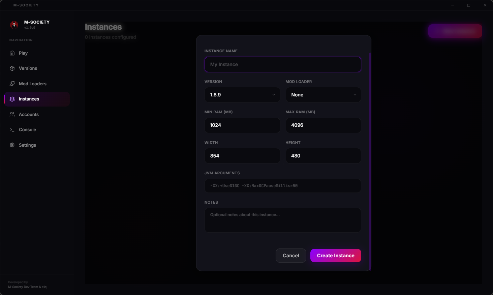
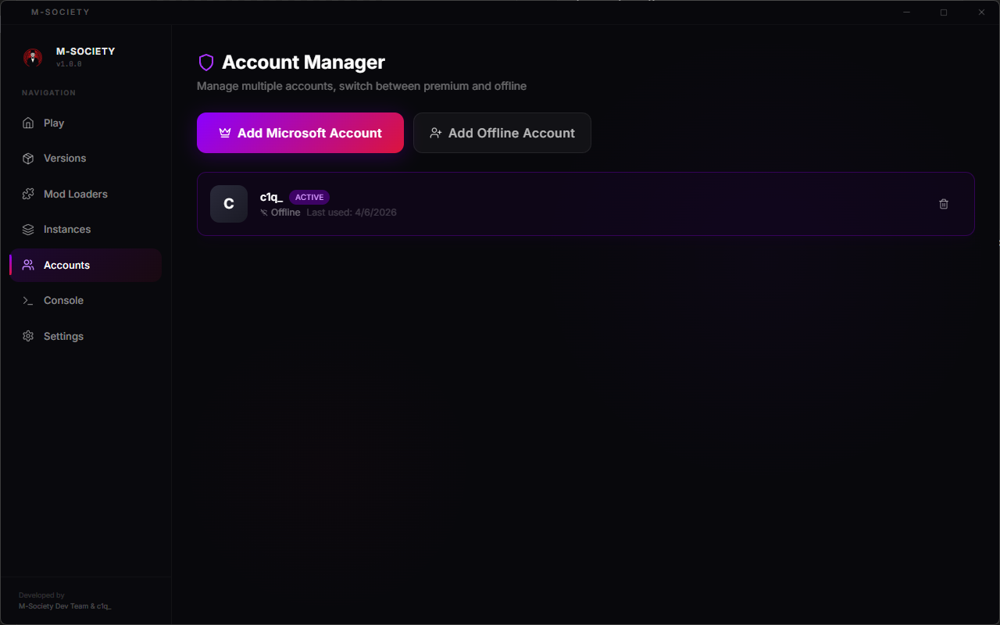
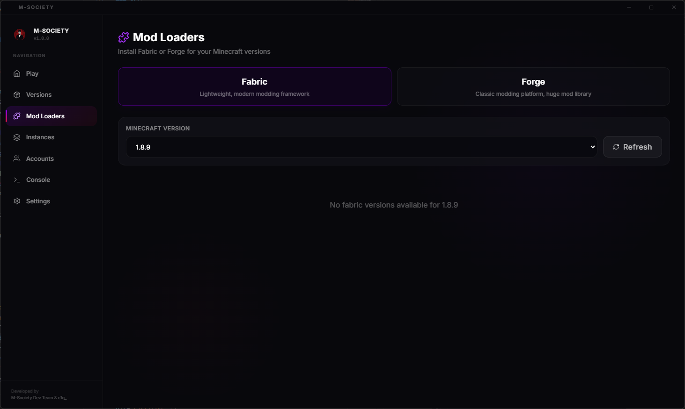
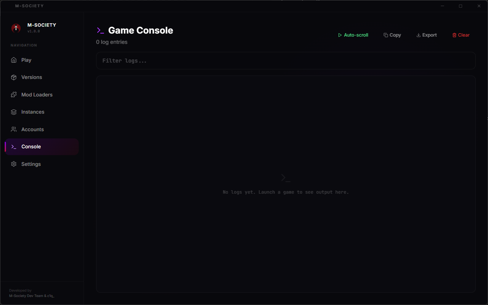
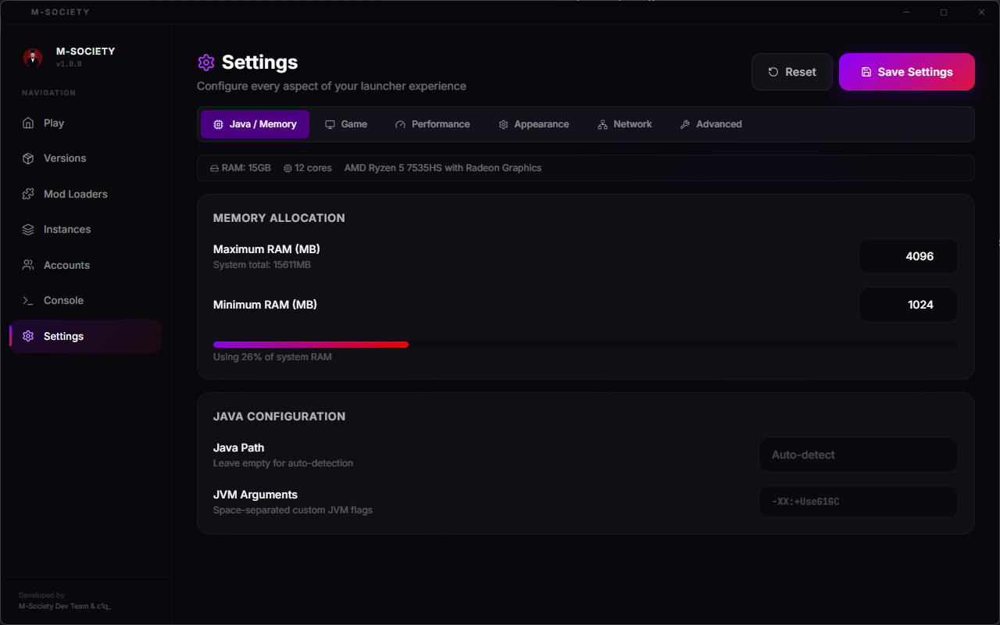

<p align="center">
  
</p>

<h1 align="center">M-Society Launcher</h1>

<p align="center">
  
</p>

<p align="center">
  <strong>El launcher de Minecraft definitivo. Rapido. Potente. Profesional.</strong>
</p>

<p align="center">
  
  
  
  
</p>

<p align="center">
  
  
</p>

<p align="center">
  <a href="https://github.com/M-Societyy/M-Society-Launcher">
    
  </a>
  &nbsp;
  <a href="https://discord.gg/w7TvFudgxm">
    
  </a>
</p>

---

## Tabla de Contenidos

- [Acerca del Proyecto](#acerca-del-proyecto)
- [Capturas de Pantalla](#capturas-de-pantalla)
- [Tecnologias](#tecnologias)
- [Caracteristicas](#caracteristicas)
- [Requisitos del Sistema](#requisitos-del-sistema)
- [Instalacion](#instalacion)
- [Ejecucion](#ejecucion)
- [Compilacion (Build)](#compilacion-build)
- [Estructura del Proyecto](#estructura-del-proyecto)
- [Configuracion Avanzada](#configuracion-avanzada)
- [Errores Comunes](#errores-comunes)
- [Contribucion](#contribucion)
- [Comunidad](#comunidad)
- [Creditos](#creditos)
- [Licencia](#licencia)

---

## Acerca del Proyecto

**M-Society Launcher** es un launcher de Minecraft de escritorio construido desde cero con las tecnologias mas modernas del ecosistema web. Diseado para ofrecer una experiencia premium con soporte completo para todas las versiones de Minecraft, cuentas premium y offline, mod loaders (Fabric/Forge), y un sistema de configuracion avanzado.

Este no es un launcher comun. Fue diseado para ser **rapido, seguro y visualmente impresionante**, con un enfoque en la experiencia del usuario que rivaliza con launchers comerciales.

---

## Capturas de Pantalla

### Home - Pantalla Principal
<p align="center">
  
</p>

### Versions - Gestor de Versiones
<p align="center">
  
</p>

### Instances - Sistema de Instancias
<p align="center">
  
</p>

### Accounts - Gestion de Cuentas
<p align="center">
  
</p>

### Mod Loaders - Fabric y Forge
<p align="center">
  
</p>

### Console - Visor de Logs
<p align="center">
  
</p>

### Settings - Configuracion Avanzada
<p align="center">
  
</p>

---

## Tecnologias

El proyecto esta construido con un stack moderno y robusto:

<table>
<tr>
<td align="center" width="120">

<br /><strong>Electron</strong>
<br /><sub>Framework Desktop</sub>
</td>
<td align="center" width="120">

<br /><strong>React 18</strong>
<br /><sub>UI Library</sub>
</td>
<td align="center" width="120">

<br /><strong>TypeScript</strong>
<br /><sub>Type Safety</sub>
</td>
<td align="center" width="120">

<br /><strong>Vite 5</strong>
<br /><sub>Build Tool</sub>
</td>
</tr>
<tr>
<td align="center" width="120">

<br /><strong>TailwindCSS</strong>
<br /><sub>Estilos</sub>
</td>
<td align="center" width="120">

<br /><strong>Framer Motion</strong>
<br /><sub>Animaciones</sub>
</td>
<td align="center" width="120">

<br /><strong>Node.js</strong>
<br /><sub>Runtime</sub>
</td>
<td align="center" width="120">

<br /><strong>Lucide</strong>
<br /><sub>Iconos</sub>
</td>
</tr>
</table>

### Dependencias Principales

| Paquete | Version | Proposito |
|---------|---------|-----------|
| `electron` | ^28.2.0 | Framework de aplicacion de escritorio |
| `react` | ^18.2.0 | Biblioteca de interfaz de usuario |
| `typescript` | ^5.3.3 | Tipado estatico |
| `vite` | ^5.0.12 | Empaquetador y dev server |
| `tailwindcss` | ^3.4.1 | Framework de estilos CSS |
| `framer-motion` | ^11.0.3 | Animaciones fluidas |
| `lucide-react` | ^0.312.0 | Iconos SVG |
| `axios` | ^1.6.7 | Cliente HTTP |
| `electron-store` | ^8.1.0 | Persistencia de datos local |
| `electron-builder` | ^24.9.1 | Compilacion y empaquetado |

---

## Caracteristicas

### Motor de Minecraft
- Soporte para **TODAS** las versiones (Release, Snapshot, Beta, Alpha)
- Descarga e instalacion automatica de versiones
- Sistema de lanzamiento con argumentos JVM personalizados
- Soporte completo para **Fabric** (mod loader ligero y moderno)
- Soporte completo para **Forge** (plataforma clasica de mods)

### Sistema de Cuentas
- Login con **Microsoft** (OAuth 2.0 Device Code Flow)
- Cuentas **Offline** (no-premium) con UUID generado
- **Multi-cuenta**: gestiona multiples cuentas y cambia entre ellas al instante
- Almacenamiento seguro de tokens

### Interfaz
- Diseno oscuro ultra-profesional con acentos purpura/rojo
- Animaciones suaves con Framer Motion
- Efectos de sonido en la interfaz (Web Audio API)
- Barra de titulo personalizada (frameless window)
- Transiciones de pagina con blur/fade
- Pantalla de carga animada

### Configuracion Avanzada
- **Memoria RAM**: minima y maxima configurable
- **Prioridad de CPU**: low, normal, high, realtime
- **Garbage Collector**: G1GC, ZGC, Shenandoah, Parallel
- **Argumentos JVM** personalizados
- **Resolucion** del juego configurable
- **Proxy** HTTP/SOCKS5
- **Hilos de descarga** configurables
- **Comandos pre/post lanzamiento**
- **Wrapper commands** (ej: mangohud)

### Sistema de Instancias
- **Instancias independientes**: cada una con su propia configuracion
- Configuracion individual de RAM, JVM args, resolucion y mod loader
- Directorio de juego separado por instancia
- Notas personalizadas por instancia
- Duplicar instancias con un click
- Rastreo de tiempo de juego por instancia
- Abrir carpeta de instancia directamente

### Consola
- Visor de logs en tiempo real
- Filtrado de logs por texto
- Coloreado por tipo (ERROR, WARN, INFO)
- Exportacion de logs a archivo
- Copiado al portapapeles
- Auto-scroll configurable

---

## Requisitos del Sistema

### Minimos
| Componente | Requisito |
|------------|-----------|
| OS | Windows 10+, Ubuntu 20.04+, macOS 11+ |
| RAM | 4 GB |
| Disco | 500 MB (sin contar versiones de Minecraft) |
| Node.js | >= 18.0.0 |
| npm | >= 9.0.0 |
| Java | JDK 17+ (para ejecutar Minecraft) |

### Recomendados
| Componente | Requisito |
|------------|-----------|
| RAM | 8 GB+ |
| Disco | SSD con 2 GB+ libres |
| Internet | 10 Mbps+ para descargas rapidas |

---

## Instalacion

### 1. Clonar el repositorio

```bash
git clone https://github.com/M-Societyy/M-Society-Launcher.git
cd M-Society-Launcher
```

### 2. Instalar dependencias

```bash
npm install
```

### 3. Logo

El logo ya esta incluido en `assets/icon.png` y `public/icon.png`. Si quieres cambiarlo, reemplaza ambos archivos con tu imagen.

> Formato recomendado: PNG 512x512px con transparencia.

---

## Ejecucion

### Modo Desarrollo (con hot-reload)

```bash
npm run dev
```

Esto ejecuta:
1. Vite dev server para el renderer (React) en `http://localhost:5173`
2. Compila el proceso principal (TypeScript)
3. Lanza Electron apuntando al dev server

### Modo Produccion (sin hot-reload)

```bash
npm run build
npm start
```

### Solo el frontend (para preview en navegador)

```bash
npm run dev:renderer
```

Luego abre `http://localhost:5173` en tu navegador.

---

## Compilacion (Build)

### Windows

```bash
npm run package
```

Genera un instalador `.exe` (NSIS) en la carpeta `release/`.

### Linux

```bash
npm run package
```

Genera:
- `.AppImage` (portable, ejecutable directo)
- `.deb` (para Debian/Ubuntu)

Ambos en la carpeta `release/`.

### macOS

```bash
npm run package
```

Genera un `.dmg` en la carpeta `release/`.

> **Nota**: Para compilar para un OS diferente al tuyo, necesitas herramientas de cross-compilation o usar CI/CD (ver seccion de errores comunes).

### Build manual paso a paso

```bash
# 1. Compilar el renderer (React -> HTML/JS/CSS)
npm run build:renderer

# 2. Compilar el main process (TypeScript -> JavaScript)
npm run build:main

# 3. Empaquetar con electron-builder
npx electron-builder
```

---

## Estructura del Proyecto

```
m-society-launcher/
|
|-- electron/                       # Proceso principal (Node.js)
|   |-- main.ts                     # Ventana, IPC handlers, ciclo de vida
|   |-- preload.ts                  # Context Bridge (API segura para renderer)
|   |-- minecraft/
|       |-- MinecraftManager.ts     # Gestion de versiones, instalacion, lanzamiento
|       |-- AccountManager.ts       # Cuentas Microsoft/Offline, multi-cuenta
|       |-- SettingsManager.ts      # Persistencia de configuracion
|       |-- InstanceManager.ts      # Sistema de instancias
|
|-- src/                            # Proceso renderer (React)
|   |-- main.tsx                    # Entry point React
|   |-- App.tsx                     # Layout principal, routing, splash screen
|   |-- index.css                   # Estilos globales + Tailwind
|   |-- components/
|   |   |-- TitleBar.tsx            # Barra de titulo personalizada
|   |   |-- Sidebar.tsx             # Navegacion lateral
|   |   |-- Logo.tsx                # Componente del logo (icon.png)
|   |   |-- ParticleBackground.tsx  # Fondo animado con particulas
|   |-- pages/
|   |   |-- HomePage.tsx            # Pagina principal (Play)
|   |   |-- VersionsPage.tsx        # Gestor de versiones
|   |   |-- InstancesPage.tsx       # Gestor de instancias
|   |   |-- AccountsPage.tsx        # Gestor de cuentas
|   |   |-- ModLoadersPage.tsx      # Instalacion Fabric/Forge
|   |   |-- SettingsPage.tsx        # Configuracion avanzada
|   |   |-- ConsolePage.tsx         # Visor de logs
|   |-- types/
|   |   |-- electron.d.ts           # Tipos TypeScript para IPC
|   |-- utils/
|       |-- SoundManager.ts         # Efectos de sonido (Web Audio API)
|
|-- assets/                         # Recursos estaticos
|   |-- icon.png                    # Icono de la aplicacion
|
|-- public/                         # Archivos publicos (servidos por Vite)
|   |-- icon.png                    # Logo accesible desde el frontend
|
|-- docs/                           # Documentacion
|   |-- screenshots/                # Capturas de pantalla
|
|-- dist/                           # Output de compilacion (generado)
|   |-- main/                       # JS compilado del proceso principal
|   |-- renderer/                   # HTML/JS/CSS del frontend
|
|-- release/                        # Instaladores generados (generado)
|
|-- package.json                    # Dependencias y scripts
|-- tsconfig.json                   # Config TypeScript (renderer)
|-- tsconfig.main.json              # Config TypeScript (main)
|-- vite.config.ts                  # Config Vite
|-- tailwind.config.js              # Config Tailwind CSS
|-- postcss.config.js               # Config PostCSS
|-- index.html                      # HTML base
|-- LICENSE                         # Licencia MIT
|-- .gitignore                      # Archivos ignorados por Git
```

---

## Configuracion Avanzada

### Ubicacion de datos

Los datos del launcher se almacenan en:

| OS | Ruta |
|----|------|
| Windows | `%APPDATA%\.msociety-launcher\` |
| Linux | `~/.config/.msociety-launcher/` |
| macOS | `~/Library/Application Support/.msociety-launcher/` |

### Archivos de configuracion

```
.msociety-launcher/
|-- settings.json          # Configuracion del launcher
|-- accounts.json          # Cuentas guardadas
|-- instances.json         # Registro de instancias
|-- versions/              # Versiones de Minecraft instaladas
|-- libraries/             # Librerias compartidas
|-- assets/                # Assets de Minecraft
|-- instances/             # Directorios individuales por instancia
|-- logs/                  # Logs del launcher
```

### Variables de Entorno

| Variable | Descripcion | Default |
|----------|-------------|---------|
| `VITE_DEV` | Activa modo desarrollo en Electron | `false` |
| `NODE_ENV` | Entorno de ejecucion | `production` |

---

## Errores Comunes

### `ERR_CONNECTION_REFUSED` al ejecutar `npx electron .`

**Causa**: El proceso principal intenta cargar `http://localhost:5173` pero el dev server no esta corriendo.

**Solucion**: Usa `npm run dev` (que inicia ambos procesos) o ejecuta primero `npm run dev:renderer` y luego en otra terminal:
```bash
set VITE_DEV=true && npx electron .
```

---

### `npm error code ETARGET` durante `npm install`

**Causa**: Alguna dependencia tiene una version que no existe en el registry.

**Solucion**: Verifica las versiones en `package.json`. Ejecuta:
```bash
npm install --legacy-peer-deps
```

---

### Error de compilacion TypeScript: `Cannot find module 'react'`

**Causa**: Las dependencias no estan instaladas.

**Solucion**:
```bash
rm -rf node_modules
npm install
```

---

### `electron-builder` falla en Linux

**Causa**: Faltan dependencias del sistema para generar `.deb` o `.AppImage`.

**Solucion** (Ubuntu/Debian):
```bash
sudo apt-get install -y rpm fakeroot dpkg
```

---

### `electron-builder` falla en macOS (firma de codigo)

**Causa**: macOS requiere firma de codigo para distribuir apps.

**Solucion**: Para desarrollo local, usa:
```bash
CSC_IDENTITY_AUTO_DISCOVERY=false npm run package
```

---

### La ventana aparece en blanco

**Causa**: Los archivos del renderer no se compilaron o la ruta es incorrecta.

**Solucion**:
```bash
npm run build
npm start
```

Verifica que `dist/renderer/index.html` existe.

---

### Java no encontrado al lanzar Minecraft

**Causa**: Java no esta instalado o no esta en el PATH del sistema.

**Solucion**:
1. Instala Java JDK 17+ desde [Adoptium](https://adoptium.net/)
2. Verifica: `java -version`
3. O especifica la ruta manualmente en Settings > Java > Java Path

---

### Errores de permisos en Linux

**Causa**: El AppImage no tiene permisos de ejecucion.

**Solucion**:
```bash
chmod +x M-Society-Launcher-*.AppImage
./M-Society-Launcher-*.AppImage
```

---

### Pantalla negra despues del splash

**Causa**: Error en algun componente React (revisa la consola de DevTools).

**Solucion**:
```bash
# Lanza en modo dev para ver errores:
npm run dev
# Presiona F12 en la ventana de Electron para abrir DevTools
```

---

## Contribucion

### Flujo de trabajo

1. Haz fork del [repositorio](https://github.com/M-Societyy/M-Society-Launcher)
2. Crea tu rama: `git checkout -b feature/mi-feature`
3. Commitea tus cambios: `git commit -m "feat: descripcion"`
4. Push a tu rama: `git push origin feature/mi-feature`
5. Abre un Pull Request

### Convenciones de commits

```
feat: nueva funcionalidad
fix: correccion de bug
docs: cambios en documentacion
style: cambios de formato (no afectan logica)
refactor: reestructuracion de codigo
perf: mejora de rendimiento
test: agregar o modificar tests
chore: tareas de mantenimiento
```

### Reglas

- No uses emojis en el codigo
- Mantener el estilo de codigo existente
- TypeScript estricto (no usar `any` sin justificacion)
- Componentes funcionales con hooks
- Comentarios solo cuando el codigo no es auto-explicativo

---

## Comunidad

Unete a nuestra comunidad para soporte, novedades y sugerencias:

<p align="center">
  <a href="https://github.com/M-Societyy/M-Society-Launcher">
    
  </a>
  &nbsp;
  <a href="https://github.com/M-Societyy/M-Society-Launcher/issues">
    
  </a>
  &nbsp;
  <a href="https://discord.gg/w7TvFudgxm">
    
  </a>
</p>

| Canal | Enlace | Descripcion |
|-------|--------|-------------|
| GitHub | [M-Societyy/M-Society-Launcher](https://github.com/M-Societyy/M-Society-Launcher) | Codigo fuente, releases, issues |
| Discord | [discord.gg/w7TvFudgxm](https://discord.gg/w7TvFudgxm) | Soporte, comunidad, sugerencias |
| Issues | [GitHub Issues](https://github.com/M-Societyy/M-Society-Launcher/issues) | Reportar bugs o solicitar features |

---

## Creditos

<table>
<tr>
<td align="center">
<strong>M-Society Dev Team</strong>
<br />
<sub>Arquitectura, Backend, Sistema de Minecraft</sub>
</td>
<td align="center">
<strong>c1q_</strong>
<br />
<sub>UI/UX, Frontend, Diseno Visual</sub>
</td>
</tr>
</table>

### Agradecimientos

- [Mojang Studios](https://www.minecraft.net/) - Minecraft
- [Fabric](https://fabricmc.net/) - Mod Loader
- [Forge](https://files.minecraftforge.net/) - Mod Loader
- [Electron](https://www.electronjs.org/) - Framework Desktop
- [Vercel](https://vercel.com/) - React & Vite
- [Tailwind Labs](https://tailwindcss.com/) - TailwindCSS

---

## Licencia

Este proyecto esta bajo la licencia **MIT**. Ver el archivo [LICENSE](LICENSE) para mas detalles.

```
MIT License

Copyright (c) 2026 M-Society Dev Team & c1q_

Permission is hereby granted, free of charge, to any person obtaining a copy
of this software and associated documentation files (the "Software"), to deal
in the Software without restriction, including without limitation the rights
to use, copy, modify, merge, publish, distribute, sublicense, and/or sell
copies of the Software, and to permit persons to whom the Software is
furnished to do so, subject to the following conditions:

The above copyright notice and this permission notice shall be included in all
copies or substantial portions of the Software.

THE SOFTWARE IS PROVIDED "AS IS", WITHOUT WARRANTY OF ANY KIND, EXPRESS OR
IMPLIED, INCLUDING BUT NOT LIMITED TO THE WARRANTIES OF MERCHANTABILITY,
FITNESS FOR A PARTICULAR PURPOSE AND NONINFRINGEMENT. IN NO EVENT SHALL THE
AUTHORS OR COPYRIGHT HOLDERS BE LIABLE FOR ANY CLAIM, DAMAGES OR OTHER
LIABILITY, WHETHER IN AN ACTION OF CONTRACT, TORT OR OTHERWISE, ARISING FROM,
OUT OF OR IN CONNECTION WITH THE SOFTWARE OR THE USE OR OTHER DEALINGS IN THE
SOFTWARE.
```

---

<p align="center">
  <sub>Hecho con dedicacion por <strong>M-Society Dev Team & c1q_</strong></sub>
</p>

<p align="center">
  <a href="https://github.com/M-Societyy/M-Society-Launcher">
    
  </a>
  <a href="https://discord.gg/w7TvFudgxm">
    
  </a>
  
  
  
  
  
</p>
